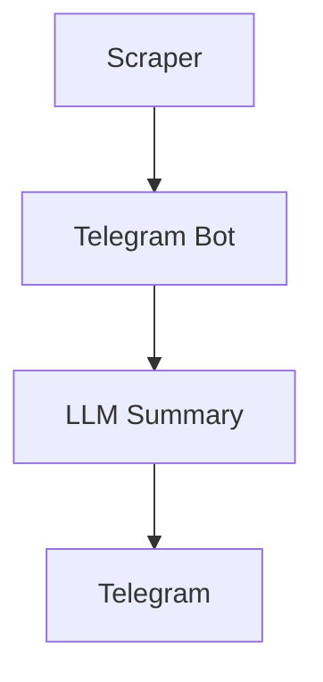
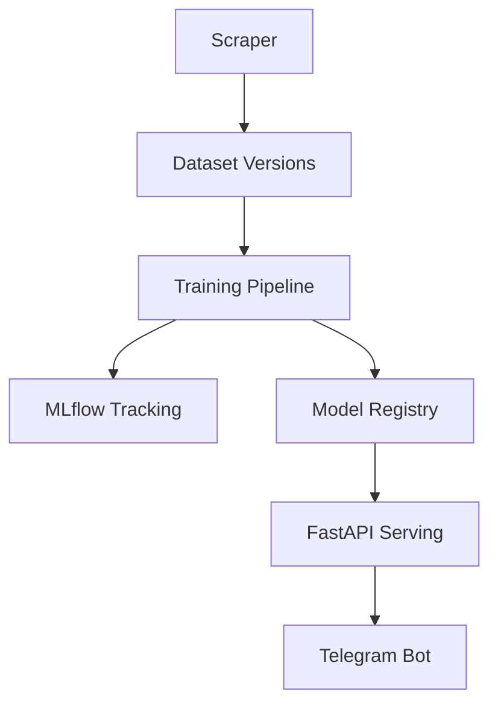
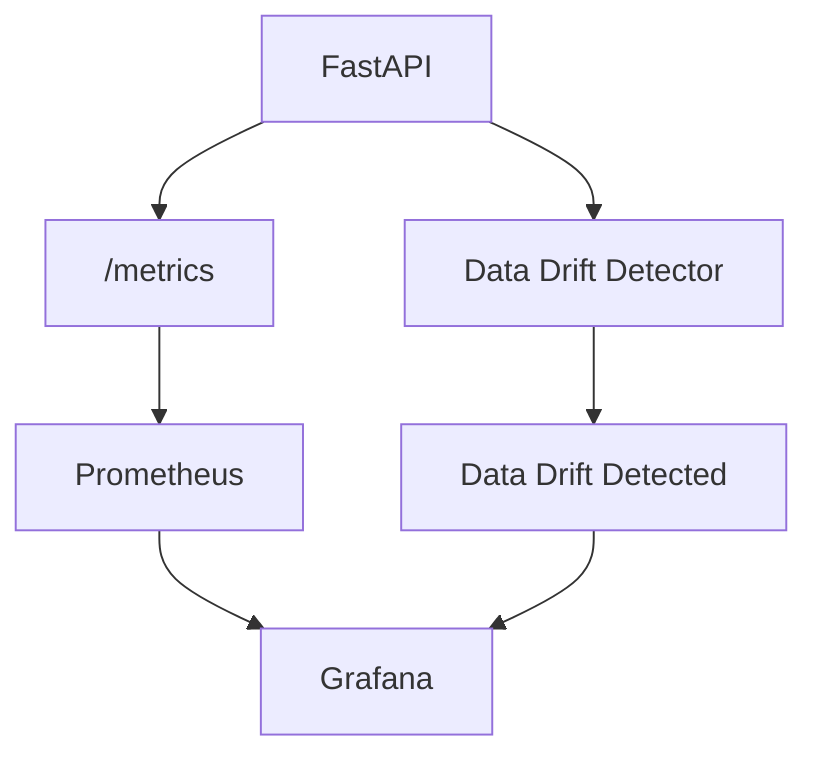

# UML Diagrams

## Before

```mermaid
flowchart TD
    Scraper["Scraper"]
    Bot["Telegram Bot"]
    LLM["LLM Summary"]
    Telegram["Telegram"]

    Scraper --> Bot
    Bot --> LLM
    LLM --> Telegram
```

## After

```mermaid
flowchart TD
    Scraper["Scraper"]
    Dataset["Dataset Versions"]
    Training["Training Pipeline"]
    MLflow["MLflow Tracking"]
    Registry["Model Registry"]
    Serving["FastAPI Serving"]
    Telegram["Telegram Bot"]

    Scraper --> Dataset
    Dataset --> Training
    Training --> MLflow
    Training --> Registry
    Registry --> Serving
    Serving --> Telegram
```

## Monitoring

```mermaid
flowchart TD
    FastAPI["FastAPI"]
    Metrics["/metrics"]
    Prometheus["Prometheus"]
    Grafana["Grafana"]
    Drift["Data Drift Detector"]
    Alert["Data Drift Detected"]

    FastAPI --> Metrics
    Metrics --> Prometheus
    Prometheus --> Grafana
    FastAPI --> Drift
    Drift --> Alert
    Alert --> Grafana
```
